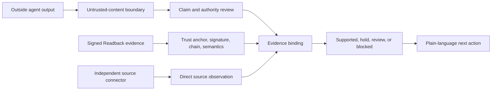

# Money Penny Readback

**A personal AI chief of staff that refuses to overclaim.**

I built Money Penny because I wanted a personal AI chief of staff I could actually trust. Her private daily workflow includes read-only inbox attention, Calendar status, reminders, controlled memory, open loops, and daily briefings.

That workflow exposed a broader problem: an AI can sound certain about work it never completed. Readback is the concrete OpenAI Build Week 2026 extension that lets Money Penny review other agents, separate claims from proof, preserve human authority, verify supported evidence, and say exactly what remains unknown.

This repository is the sanitized competition edition. It combines synthetic trust scenarios, a fixed local Git connector, and a live read-only connector for public GitHub repositories. It requires no personal account, API key, or cloud model.

## Try It Now

Open the isolated public demo: [money-penny-readback-demo.vercel.app](https://money-penny-readback-demo.vercel.app).

Watch the final 2:50 walkthrough: [Money Penny Readback - OpenAI Build Week 2026](https://youtu.be/jcaIugHfPLQ).

The hosted edition has no connection to the private Money Penny service and enables no writes. In `Public GitHub`, enter any public `owner/repository`, generate a matching or false coding-agent report, and watch Money Penny compare it with GitHub's live public metadata and exact default-branch reference. No credentials, repository clone, command execution, filenames, file contents, commit details, or arbitrary URL fetches are used.

The Trust Lab and generated coding-agent reports are synthetic. The selected public repository facts are real and checked on demand. Clone and run the repository locally for the separate direct read-only Git worktree connector.

Do not paste personal or secret data into a public demo.

## Run It Locally

Requires Node.js 24 and Git.

```bash
npm ci
npm start
```

Open [http://127.0.0.1:4574](http://127.0.0.1:4574).

The first screen is the working product:

1. `Trust Lab` generates fresh proof bundles and demonstrates unproven, verified, unknown-signer, tampered, and prompt-attack outcomes.
2. `Public GitHub` in the hosted demo checks a selected public repository through two fixed metadata-only requests; the same mode becomes `Live Git` locally and uses fixed read-only Git commands.
3. `Review output` accepts another agent's answer and optional Readback evidence for claim-level review.

## The Core Standard

An agent saying "done" is a claim, not a fact.



Money Penny does not let reviewed text grant approval, register a trusted key, choose a tool command, choose a local repository path, redirect a source request, or turn a review receipt into proof that the outside action happened. The user can select a public GitHub repository through a dedicated, strictly parsed source field; the agent report cannot change the destination boundary.

## What Is Real

The competition UI is backed by the same deterministic modules used by the private assistant:

- `foundry/moneypenny-agent-review.mjs` classifies claims, isolates prompt attacks and secret-shaped values, and issues the strongest supported verdict.
- `foundry/moneypenny-git-reality-check.mjs` invokes only fixed Git read operations, returns bounded facts, and never returns paths, filenames, contents, or raw status.
- `foundry/moneypenny-public-github-reality-check.mjs` accepts only public github.com repository identifiers, calls two fixed read-only GitHub API endpoints, and returns only repository identity, default branch, short HEAD, visibility, and archive state.
- `packages/readback` implements proposal, approval, deterministic execution, readback, Ed25519 signatures, previous-hash chaining, proof export, and offline verification.
- `lib/trust-lab.mjs` generates fresh trusted and unknown keypairs in an operating-system temporary directory on each launch.

If the project was cloned with Git, the local connector checks that clone. If it was downloaded without Git history, the local launcher creates a temporary synthetic repository so the connector remains runnable and says that it is synthetic. The public Vercel interface uses the live public GitHub connector. A bundled snapshot remains only as a deterministic hosted regression fixture and is not presented as live evidence.

## Build Week Extension

Money Penny's personal-assistant foundation existed before Build Week: daily briefing, read-only inbox attention, Calendar status, reminders, memory, open loops, and controlled writes with readback.

The meaningful work added for Build Week is:

- The zero-dependency `readback` package and independent verifier.
- Hash-bound, expiring, single-use approvals.
- Signed, chained proof bundles with semantic event-order checks.
- Trusted-runner pinning outside reviewed content.
- The Honesty Filter and its claim-level verdict contract.
- Prompt-attack, secret-value, self-issued-key, replay, forgery, deletion, reorder, expiry, orphan-execution, and schema-downgrade defenses.
- The fixed read-only Git source connector.
- The fixed-host, metadata-only public GitHub source connector.
- This synthetic, reproducible, privacy-scanned competition release.

## Verify It

```bash
npm test
npm run verify
```

`npm test` runs the application/API checks plus the Readback unit and adversarial suites. `npm run verify` checks the release structure, zero-dependency contract, prohibited paths, secret patterns, and export-manifest hashes when a manifest is present.

The test suite confirms:

- Every Trust Lab scenario returns its expected distinct verdict.
- A valid proof from an unknown signer cannot gain authority.
- Altered evidence fails closed.
- Prompt-attack content is blocked and not echoed.
- A direct Git fact is supported and a conflicting Git fact is blocked.
- A real public GitHub fact is supported and a false default-branch revision is blocked.
- Public source input cannot redirect the connector away from `api.github.com` or supply credentials, commands, write methods, file endpoints, or private repository access.
- API requests cannot supply a repository path or trusted-key list.
- Review requests do not change the checked repository.
- The HTTP server binds to loopback and rejects cross-origin requests.

## How Codex Helped

Codex was the primary engineering partner. It audited the existing assistant, traced authority and completion claims through the runtime, implemented the Readback and Honesty Filter paths, found misleading completion wording through browser testing, designed adversarial cases, extracted a portable release boundary, built this judge-runnable edition, and repeatedly tested its own assumptions against observed behavior.

The primary Codex `/feedback` session ID is provided in the Devpost submission field.

## How GPT-5.6 Helped

GPT-5.6 contributed product judgment, claim classification, intent reasoning, threat analysis, UX decisions, competition research, and the central design correction: governing what an agent may do is not enough; a trustworthy assistant must also govern what the agent may claim it did.

The judging runtime intentionally makes no cloud-model call. GPT-5.6 helped design and build the system, while the safety-critical demonstration remains deterministic and reproducible without credentials.

## Privacy And Authority

- The local server binds only to `127.0.0.1`; hosted APIs enforce same-origin requests.
- Uses synthetic Trust Lab inputs and temporary proof stores.
- Uses no personal Gmail, Calendar, reminders, memory, OAuth data, or account identifiers.
- Makes no cloud-model or AI-provider call. The hosted public-repository check makes only two bounded HTTPS GETs to `api.github.com` when explicitly selected.
- Enables no message, account, deployment, payment, Calendar, reminder, or repository write.
- Never accepts a trusted signing key, tool command, local repository path, arbitrary network destination, or credential from reviewed content or an API request.
- Persists no raw reviewed output or evidence.

See [SECURITY.md](SECURITY.md) and [docs/ARCHITECTURE.md](docs/ARCHITECTURE.md).

## Honest Limits

- A signature proves integrity and signer possession, not that the signer deserves trust. Trust anchors must be pinned separately.
- The deterministic Readback runner proves the output it wrote, reread, and hashed. It does not defend a compromised host or stolen signing key.
- The Git connector verifies only recognized revision, clean/dirty, and changed-item-count claims.
- The public GitHub connector checks only public repository identity, default branch, current default-branch HEAD, visibility, and archive state. It cannot inspect private repositories, local worktrees, pull-request intent, test results, or file contents.
- Public GitHub reads are anonymous and therefore subject to GitHub's unauthenticated API limit. A 30-second in-memory cache reduces repeated reads; rate-limit failures are reported rather than replaced with synthetic evidence.
- Arbitrary real-world truth needs a source-specific read-only connector and outcome contract.
- This is a personal research prototype, not a production security boundary or formal verification system.
- The hosted demo is served by Vercel and is subject to the platform's normal infrastructure logging; Money Penny stores no raw review body.

License: MIT.
