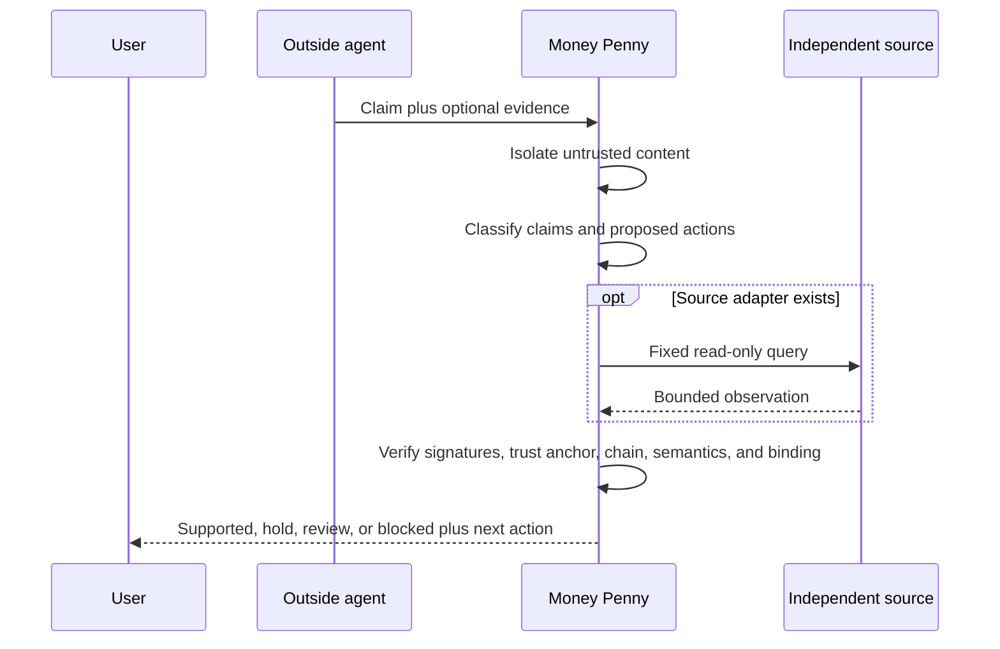

# Architecture

## Layers

### 1. Untrusted Input Boundary

Outside-agent output and supplied evidence are bounded, normalized, fingerprinted, and treated as data. Instruction-like content and secret-shaped values are isolated before any source connector can run.

### 2. Claim Review

The Honesty Filter separates completion, approval, action proposal, negative completion, factual, and advisory statements. Each checkable claim receives its own assessment and reason.

### 3. Evidence Verification

Readback proof verification checks full Ed25519 signatures, previous-hash links, the signed head snapshot, event semantics, exact proposal and approval references, single-use approval, and trusted-signer pinning.

### 4. Direct Source Readback

Two adapters demonstrate the next layer: independently query a system of record rather than rely only on claimant-supplied proof.

- Local Git exposes three bounded facts from the fixed local repository: revision, clean or dirty state, and changed-item count.
- Public GitHub exposes five bounded facts from a user-selected public repository: canonical identity, default branch, current default-branch HEAD, public visibility, and archive state.

The hosted connector never follows a claimant-supplied URL. It strictly parses `owner/repository`, constructs two HTTPS GETs under `api.github.com`, and discards every response field outside its fixed observation contract.

### 5. Verdict And Receipt

The verdict is the strongest conclusion the evidence permits. A completion receipt proves only that Money Penny completed the review. It never implies that the reviewed external action happened.

## Authority Flow

The user remains the authority boundary. The review can recommend a next step but cannot approve or execute it.

## Export Boundary

The private personal assistant is not published. The release exporter copies only an explicit allowlist:

- Competition application and documentation.
- Portable Honesty Filter modules.
- Fixed Git connector.
- Fixed-host public GitHub connector.
- Readback package, tests, schema, and independent verifier.

It then runs tests, privacy scanning, and file-hash manifest verification from a newly created directory.
